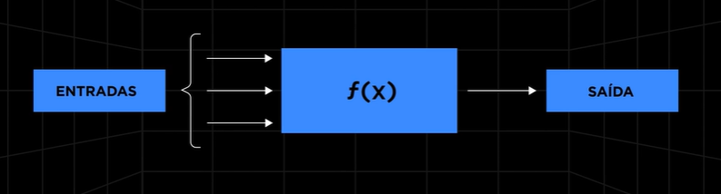
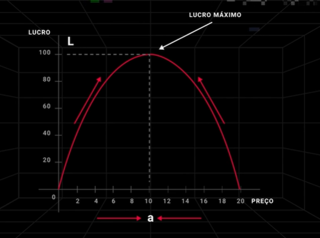
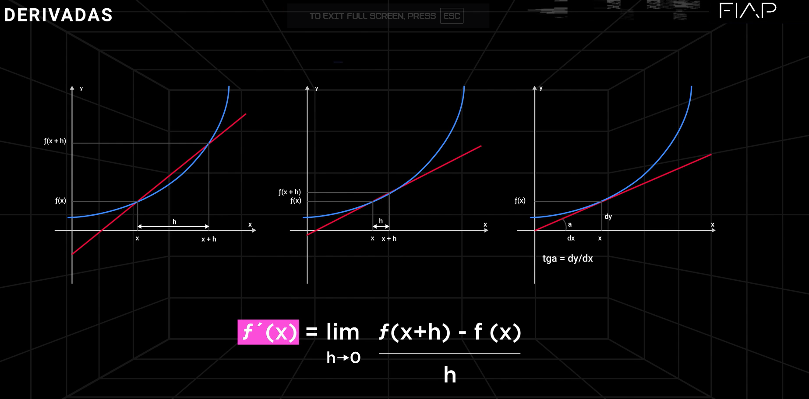
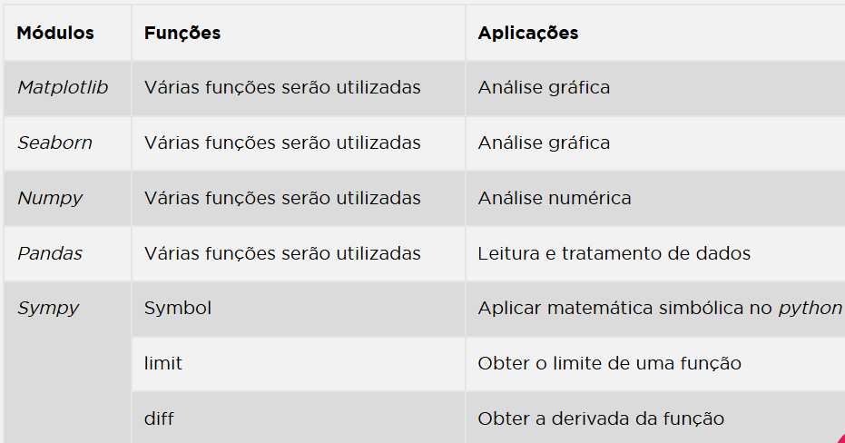

# Limites e Derivadas com Python

Desenvolver e aplicar algoritmos para resolver problemas de negócios faz parte da minha rotina como cientista de dados. Grande parte desses algoritmos é construída com técnicas de Machine Learning, como regressão linear, logística e análise de agrupamentos.

No entanto, percebo que, para aplicar esses métodos de forma realmente eficiente, é fundamental compreender conceitos matemáticos como vetores, matrizes, determinantes, derivadas e integrais. Esse conhecimento me permite adaptar os algoritmos às necessidades específicas que surgem nas diferentes áreas de negócio.

Antes de aprofundar nos conceitos, acho importante lembrar que o cálculo surgiu no século XVII, com o objetivo de resolver problemas como a determinação da tangente a uma curva, o estudo do volume de sólidos, a busca por valores máximos e mínimos de funções, além da criação de fórmulas para descrever distância percorrida, velocidade e aceleração.

Os principais responsáveis por esse avanço foram Isaac Newton e Gottfried Leibniz, que, de forma independente, desenvolveram o cálculo com metodologias diferentes, mas igualmente impactantes. 

Nos próximos tópicos, vou explicar esses conceitos, mostrar sua aplicação na análise de dados e demonstrar como utilizá-los na prática com módulos e funções de programação em Python.
    
## Principais conceitos de Funções, Limites e Derivadas

Derivadas -> Taxa de Variação instantanea

## Resumo

1. Conceitos de Funções
Modelagem matemática.
Relação entre entradas e saídas de um processo.
Exemplos de diferentes tipos de funções em modelos matemáticos.
2. Limites
Conceito de limites de forma visual.
Aproximação de uma função a um valor específico.
Exemplos práticos de aplicação de limites em negócios (análise de preço e lucro).
3. Derivadas
Importância das derivadas na minimização de erros em Machine Learning.
Regras básicas de derivação:
Regra da constante.
Regra da potência.
Regras de multiplicação e divisão.
Derivadas de logaritmos e exponenciais.
Exemplos práticos em problemas de negócios (sensibilidade do lucro em relação a preços).
4. Python e Bibliotecas
Principais bibliotecas para análise numérica e gráfica:
NumPy.
pandas.
Matplotlib.
Seaborn.
SymPy (operações simbólicas para limites e derivadas).
  

5. Exemplos Práticos em Python
Definição de símbolos e criação de funções.
Cálculo de limites e derivadas.
Análises gráficas com a biblioteca SymPy.
6. Atividade Prática
Proposta de uma atividade para fixação dos conceitos, envolvendo a análise de uma função de lucro em relação ao preço.
7. Objetivo da Aula
Fornecer uma base sólida sobre funções, limites e derivadas, aplicando-os em problemas de negócios com Python, essencial para cientistas de dados em Machine Learning.
