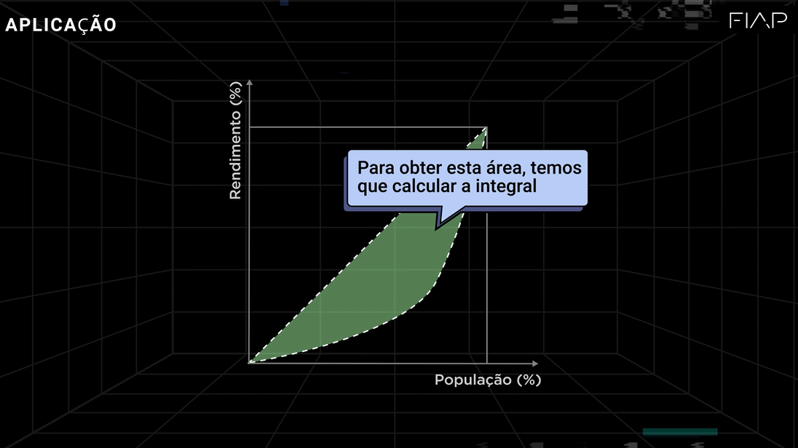

# Conceito de Integrais 

Muito importante em machine learn para testar os modelos

### Resolução de integrais

A ideia principal é que, para encontrar a área exata de uma forma irregular, como a área sob uma curva, você pode dividi-la em retângulos muito pequenos.

A primeira linha (S) representa a soma das áreas de todos esses retângulos.

A segunda linha (A) mostra o que acontece quando a largura de cada retângulo se aproxima de zero, tornando-os infinitamente pequenos. Isso transforma a soma em uma área exata.

A terceira linha (A=∫ 
a
b
​
 f(x)dx) é a notação de integral definida, que é a forma matemática de representar essa soma infinita.

Basicamente, uma integral é uma ferramenta para calcular a área exata sob uma curva.

#### Ultilização dos integrais

Ela mostra um gráfico de uma curva que provavelmente representa a distribuição de rendimento em uma população. O eixo horizontal ("População (%)") mostra a porcentagem da população, e o eixo vertical ("Rendimento (%)") mostra a porcentagem da renda total. e essa área verde entre ela indica o nivel de desigualdade

## Índice de Gini

        O conceito do índice de Gini é baseado em obter a área entre duas curvas. A primeira curva (a linha reta) é denominada de “área de igualdade de renda”; a segunda curva significa “área de desvio da igual”. Quanto maior a área entre essas curvas, maior a desigualdade de renda do país analisado.
      

O Índice de Gini é uma medida usada para calcular a desigualdade de distribuição de renda em um país, estado ou grupo de pessoas.

Em poucas palavras, ele funciona assim:

O valor do índice varia de 0 a 1.

Um valor perto de 0 significa que a distribuição de renda é muito igualitária, ou seja, a riqueza está bem distribuída entre a população.

Um valor perto de 1 indica que a distribuição de renda é muito desigual, concentrando a riqueza nas mãos de poucas pessoas.

## Principais Funções no Python 

<table class="on-table on-table-primary">
          <tbody><tr>
            <td>
              <b>Módulos</b>
            </td>
            <td>
              <b>Funções</b>
            </td>
            <td>
              <b>Aplicações</b>
            </td>
          </tr>
          <tr>
            <td>
              <i>Matplotlib</i>
            </td>
            <td>
              Várias funções serão utilizadas
            </td>
            <td>
              Análise gráfica
            </td>
          </tr>
          <tr>
            <td>
              <i>Seaborn</i>
            </td>
            <td>
              Várias funções serão utilizadas
            </td>
            <td>
              Análise gráfica
            </td>
          </tr>
          <tr>
            <td>
              <i>Numpy</i>
            </td>
            <td>
              Várias funções serão utilizadas
            </td>
            <td>
              Análise numérica
            </td>
          </tr>
          <tr>
            <td>
              <i>Pandas</i>
            </td>
            <td>
              Várias funções serão utilizadas
            </td>
            <td>
              Leitura e tratamento de dados
            </td>
          </tr>
          <tr>
            <td rowspan="3"><i>Sympy</i>
            </td>
            <td>
              Symbol
            </td>
            <td>
              Aplicar matemática simbólica no <i>python</i>
            </td>
          </tr>
          <tr>
            <td>
              lambdify
            </td>
            <td>
              Transformar função simbólico para função <i>lambda python</i>
            </td>
          </tr>
          <tr>
            <td>
              integrate
            </td>
            <td>
              Obter a integral da função
            </td>
          </tr>
        </tbody></table>

    