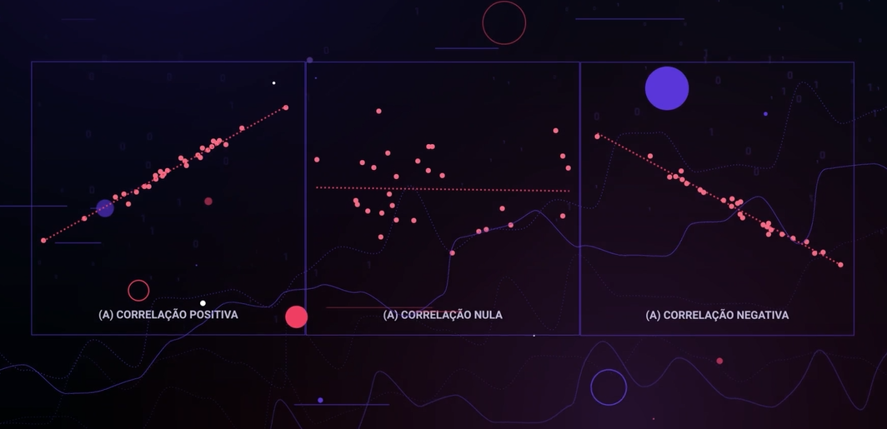

# Análise de Correlação e Associação com Python

A aula aborda os conceitos principais de associação e correlação na análise de dados. Inicialmente, são discutidos os questionamentos que surgem ao trabalhar com múltiplas variáveis, destacando a importância de entender se existe associação ou correlação entre elas. Pesquisadores como Sir Francis Galton, Karl Pearson e George Udny Yule são mencionados como contribuintes para o desenvolvimento desses conceitos.

As diferenças entre associação e correlação são explicadas:

- **Associação**: Conceito mais amplo, avalia como uma variável contribui para entender outra.
- **Correlação**: Coeficiente que mede a força e a direção do relacionamento linear entre duas variáveis.

Os principais coeficientes de associação (como Phi e V de Cramer) e correlação (como Pearson, Spearman e Kendall) são apresentados, juntamente com testes para verificar a significância estatística.

No contexto prático, são mostradas ferramentas em Python, como `crosstab`, `corr` e `pairwise_corr`, com exemplos que incluem tratamentos de pacientes e pesquisa de satisfação de clientes.

Por fim, uma atividade prática é proposta, permitindo que os alunos apliquem os conhecimentos adquiridos em um conjunto de dados, estimando os coeficientes de associação e correlação entre as variáveis. A aula fornece uma base sólida para a análise de dados.

