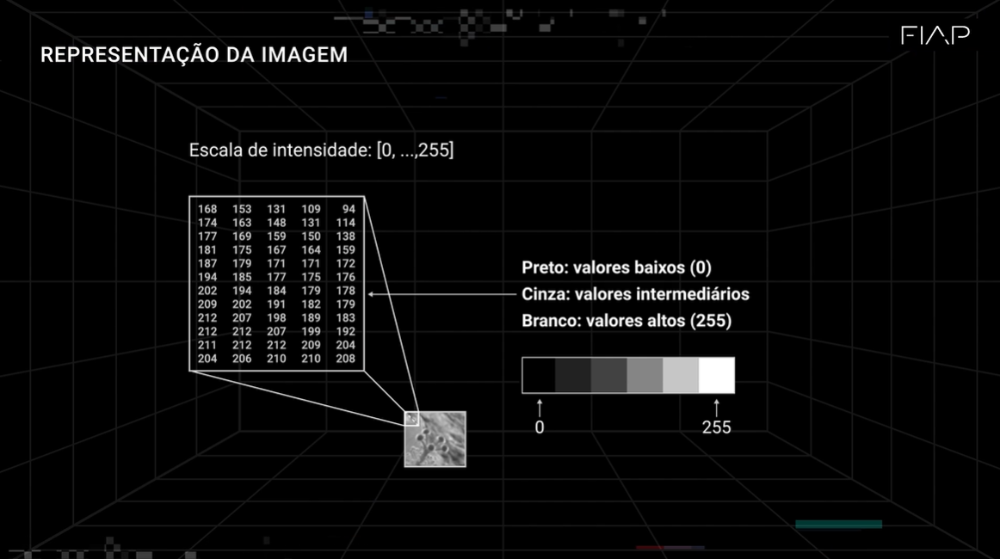
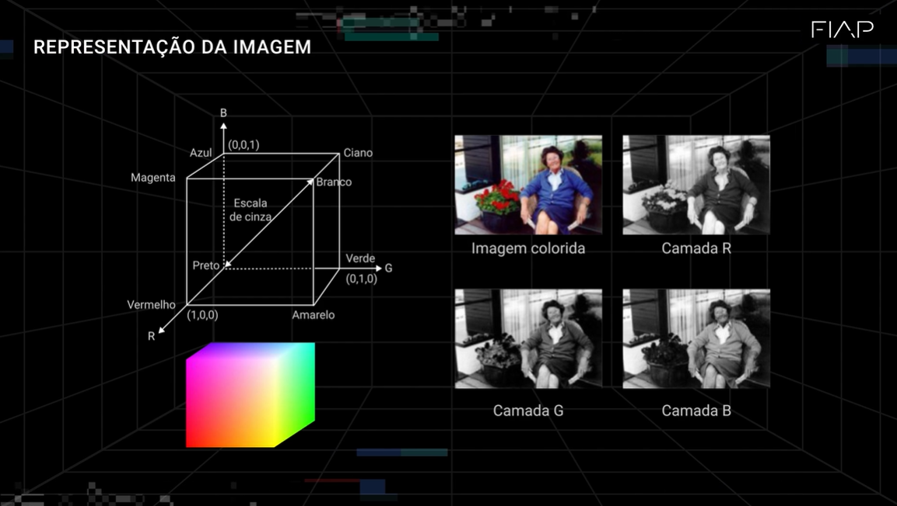
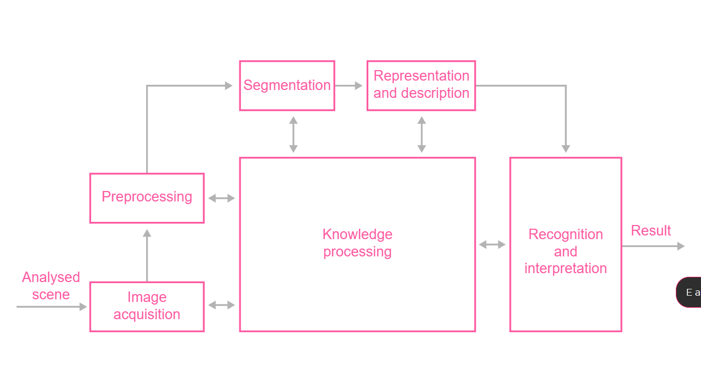

# Analise de Imagem

Os humanos aprendem naturalmente por meio da visão, adquirindo experiências apenas ao observar. Em analogia, compara os olhos a câmeras que registram imagens continuamente, as quais são armazenadas e utilizadas pelo cérebro como lembranças para o processo de aprendizado e teste.

## Resumo 

- **Conceitos Básicos**: A aula discute como máquinas conseguem &quot;ver&quot; e interpretar imagens, semelhante aos seres humanos, introduzindo a área de visão computacional e sua evolução.

- **Importância da Análise de Imagens**: A análise é crucial em diversas áreas, como telecomunicações, biologia, medicina e robótica, com o objetivo de identificar padrões, categorizar objetos e fornecer interpretações semânticas.

- **Desafios**: São abordados os desafios na análise de imagens, incluindo variações de posição, fundo, cores e a análise de imagens em movimento.

- **Processo de Análise**:
  - **Processamento de Baixo Nível**: Aquisição, pré-processamento e aprimoramento da imagem.
  - **Processamento de Nível Intermediário**: Extração e descrição dos componentes da imagem.
  - **Processamento de Alto Nível**: Classificação, reconhecimento e interpretação de imagens.

- **Análise Quantitativa**: Imagens são representadas por matrizes, com a importância dos tensores para algoritmos de Machine Learning, que realizam classificações e reconhecimento de padrões.

- **Relação com Machine Learning**: Menciona o desafio ImageNet e a evolução dos algoritmos de classificação, destacando como avanços em bancos de dados e técnicas como Deep Learning melhoraram os resultados.

- **Ferramentas em Python**: Apresenta as principais funções para análise de imagens, incluindo os módulos `numpy`, `pandas`, `matplotlib`, `seaborn`, `pytesseract`, `cv2`, `PIL` e `imutils`.

- **Atividade Prática**: Proposta de realizar análises em uma imagem específica, como carregar, plotar a imagem, obter suas propriedades e explorar diferentes escalas de cor.

A aula oferece uma visão abrangente e prática sobre a análise de imagens, apresentando conceitos, técnicas e ferramentas para aplicação em Python.

## Processamento x Análise de Imagem

- Processar → Aplicar operações para extrair informações e identificar padrões.

*Comparação com humanos:*

- Computador: Captar (Câmera) → Armazenar (HD) → Analisar (Processador)

- Humanos: Captar (Olhos) → Armazenar (Memória) → Analisar (Cérebro)

## Como o Computador Vê uma Imagem

O computador interpreta imagens como matrizes de valores numéricos, onde cada número representa a intensidade de cor em cada ponto (pixel).

- Imagens em Preto e Branco (tons de cinza):

    - Valores variam de 0 a 255

    - 0 → Branco

    - 125 → Cinza

    - 255 → Preto

- Imagens Coloridas (RGB):

    - Representadas por três valores: R (vermelho), G (verde) e B (azul)

    - Exemplo: (0, 0, 0) → Preto / (255, 255, 255) → Branco

### Exemplos

Como o computador interpreta imagens em preto e branco:

Como o computador interpreta imagens coloridas:

## Principais Funções no Python 

<table class="on-table on-table-primary">
          <tbody><tr>
            <td>
              <b>Módulos</b>
            </td>
            <td>
              <b>Funções</b>
            </td>
            <td>
              <b>Aplicações</b>
            </td>
          </tr>
          <tr>
            <td>
              <i>Matplotlib</i>
            </td>
            <td>
              Várias funções serão utilizadas
            </td>
            <td>
              Análise gráfica
            </td>
          </tr>
          <tr>
            <td>
              <i>Seaborn</i>
            </td>
            <td>
              Várias funções serão utilizadas
            </td>
            <td>
              Análise gráfica
            </td>
          </tr>
          <tr>
            <td>
              <i>Numpy</i>
            </td>
            <td>
              Várias funções serão utilizadas
            </td>
            <td>
              Análise numérica
            </td>
          </tr>
          <tr>
            <td>
              <i>Pandas</i>
            </td>
            <td>
              Várias funções serão utilizadas
            </td>
            <td>
              Leitura e tratamento de dados
            </td>
          </tr>
          <tr>
            <td>
              <i>Pytesseract</i>
            </td>
            <td>
              Funções voltadas a OCR
            </td>
            <td>
              Transformar imagem em texto
            </td>
          </tr>
          <tr>
            <td>
              <i>Cv2</i>
            </td>
            <td>
              <i>imread</i>
            </td>
            <td>
              Função para leitura da imagem
            </td>
          </tr>
          <tr>
            <td>
              <i>PIL</i>
            </td>
            <td>
              <i>Image</i>
            </td>
            <td>
              Captar imagem e transformar em matriz
            </td>
          </tr>
          <tr>
            <td>
              <i>imutils</i>
            </td>
            <td>
              <i>rotate_bound</i>
            </td>
            <td>
              Rotacionar a imagem
            </td>
          </tr>
        </tbody></table>

